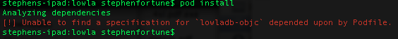
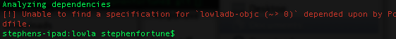
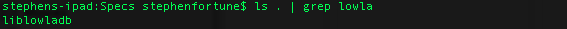

#Feedback - 29:09:2014

###Cocoa Pod

- [These](https://github.com/lowla/lowladb-objc#installation) instructions didn't work for me.
- Tried a couple of variations:

- Could not find the pod via CocoaPods search index:

- Cloned the actual CocoaPods [specs repo](https://github.com/CocoaPods/Specs) from github and found `liblowladb` but not `lowladb-objc`:

###Disclaimer

These are my immediate note while using the Lowla Obj-C library.

- They may be arbirary or based purely on my opinion. 
- They may already be planned for in the future
- If anything in here is technically incorrect, do let me know !
