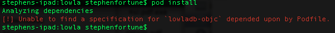

#Feedback - 29:09:2014

###Cocoa Pod (Bug)

- [These](https://github.com/lowla/lowladb-objc#installation) instructions didn't work for me:

- Cloned the actual CocoaPods [specs repo](https://github.com/CocoaPods/Specs) from github and found `liblowladb` but not `lowladb-objc`:

- Ended up referencing the `lowla-objc` repo directly
